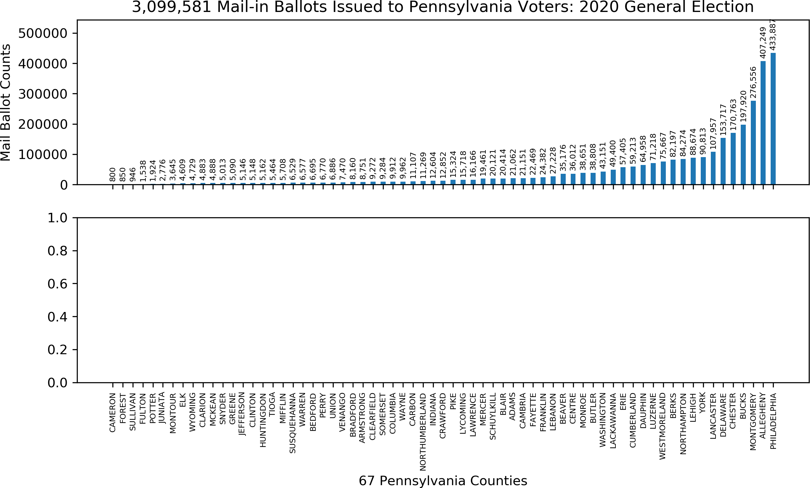

# PA Government Open Data
Work with the [opendata](https://data.pa.gov/) from the Commonwealth of Pennsylvania

## Links

* [County Unofficial Mail Ballot Requests Statistics](https://data.pa.gov/Government-Efficiency-Citizen-Engagement/2020-General-Election-Unofficial-Mail-Ballot-Proce/pg3c-9a9m)
* [2020 Election results](https://www.inquirer.com/politics/election/inq/pennsylvania-election-results-2020-20201103.html)
* [Latest election news from The Philly Inquirer](https://www.inquirer.com/politics/election/live/elections-2020-results-candidates-updates-news-pennsylvania-20201106.html)

Copyright (C) 2020-present, DV Klopfenstein. All rights reserved.
